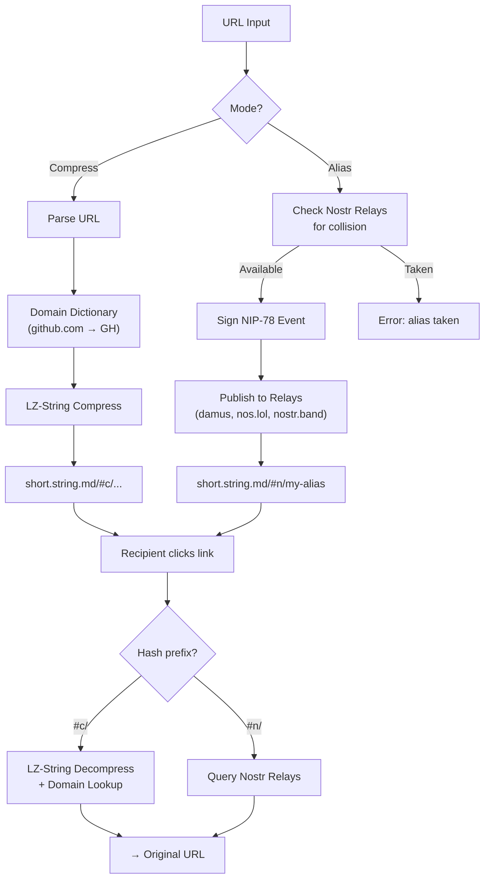

# short.string.md

Serverless URL shortener. No server, no database, no sign-up.

URLs are shortened client-side using compression or published as aliases to decentralised Nostr relays.
Everything runs in the browser — the site is a single static HTML file hosted on GitHub Pages.

## How It Works



## Features

### Web App ([short.string.md](https://short.string.md))

- **Compression mode** — LZ-string compression with a domain dictionary (common domains like `github.com` → `GH` for shorter output)
- **Alias mode** — human-readable names stored on Nostr relays using NIP-78
- **Zero infrastructure** — everything is client-side; the site is a single `index.html` on GitHub Pages
- **P2P swarming** — optional WebRTC peer-to-peer relay for alias resolution (via trystero)
- **No tracking, no accounts** — keys are generated locally and stored in `localStorage`

### Browser Extension (Firefox / Zen)

- **Popup** — shorten the current tab URL with one click
- **Context menu** — right-click any link → "Shorten with short.string.md"
- **Keyboard shortcut** — `Cmd+Shift+S` (Mac) / `Ctrl+Shift+S`
- **Clickable results** — shortened URL opens in a new tab, with a copy button
- **History** — last 500 shortened URLs, persisted across sessions
- **Swarm toggle** — opt-in P2P swarming with consent dialog

## URL Format

| Mode | Format | Example |
|------|--------|---------|
| Compressed | `short.string.md/#c/<lz-data>` | `short.string.md/#c/MYewdgJghsAuC...` |
| Alias | `short.string.md/#n/<name>` | `short.string.md/#n/my-project` |

Compressed URLs are self-contained — the entire original URL is encoded in the fragment.
No server lookup needed.

Alias URLs require a Nostr relay query to resolve.

## Install the Extension

1. Download `short-string-md-extension-v0.1.0.zip` from [Releases](https://github.com/HackrsValv/short.string.md/releases)
2. Extract the zip
3. In Firefox/Zen: navigate to `about:debugging` → "This Firefox" → "Load Temporary Add-on" → select `extension/manifest.json`

## Domain Dictionary

Common domains are mapped to short codes before compression, reducing output length:

| Domain | Code |
|--------|------|
| google.com | G |
| youtube.com | Y |
| github.com | GH |
| reddit.com | R |
| x.com | X |
| wikipedia.org | W |
| stackoverflow.com | SO |
| ... | ... |

The full dictionary is in [`index.html`](index.html) and [`extension/shorten.js`](extension/shorten.js).

## Architecture

```
short.string.md/
├── index.html          # The entire web app (single file)
├── CNAME               # GitHub Pages custom domain
├── extension/          # Firefox/Zen browser extension (MV2)
│   ├── manifest.json
│   ├── background.html # Loads bundled libraries
│   ├── background.js   # Context menu, message routing, badge
│   ├── shorten.js      # Compression + Nostr logic (bundled from index.html)
│   ├── popup.html      # Extension popup UI
│   ├── popup.js        # Popup interaction logic
│   └── lib/            # Vendored dependencies
│       ├── lz-string.min.js
│       └── nostr-tools.bundle.js
└── eidos/              # Specs and design documents
```

## License

MIT
